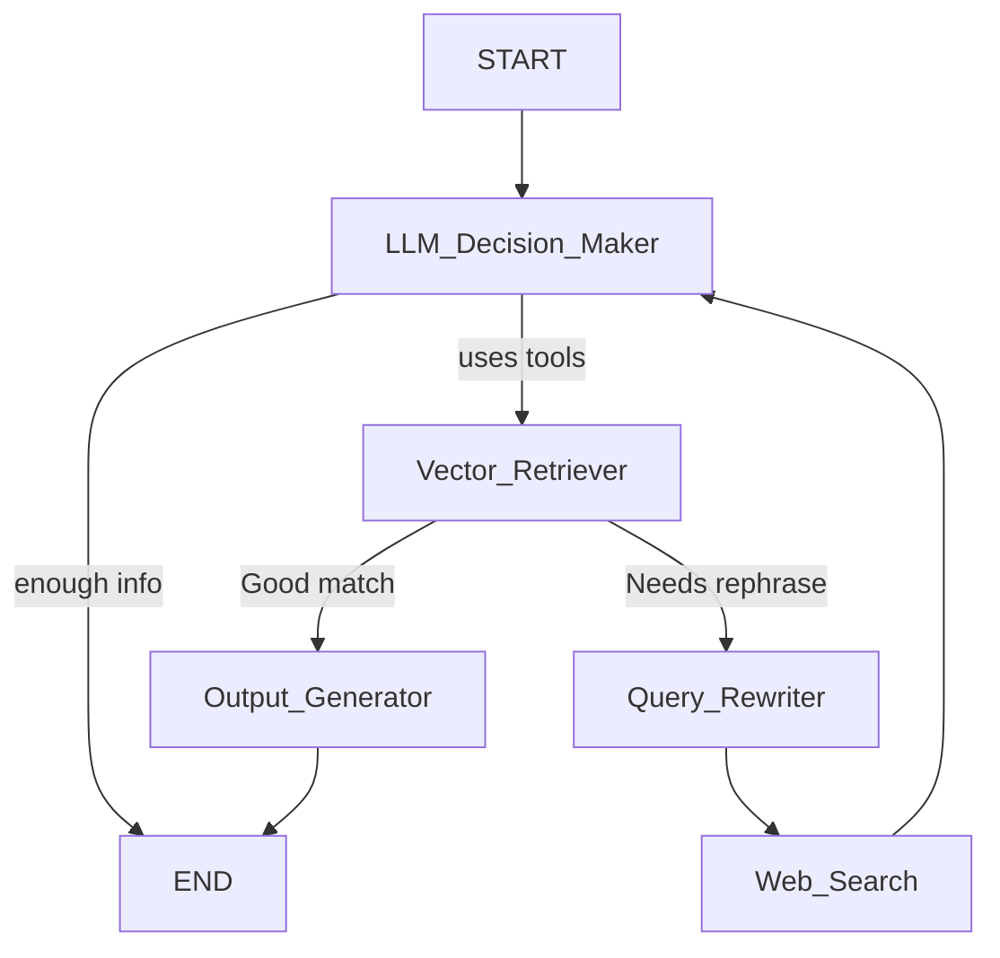

# 🧠 Agentic RAG Workflow with LangGraph

This project demonstrates an **Agentic Retrieval-Augmented Generation (RAG)** system using **LangGraph** and **tool-augmented reasoning**. The graph-based agent dynamically routes between vector search, query rewriting, and web search to generate high-quality answers from both structured and unstructured data.

---

## 🚀 Features

- ✅ Modular nodes (LLM, retriever, rewriter, web search)
- ✅ Conditional routing based on context (e.g., hallucination or low relevance)
- ✅ Dynamic graph traversal with LangGraph
- ✅ Tools-aware decision-making
- ✅ End-to-end execution with grading function

---

## 🧠 Architecture

---

